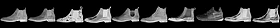

# vae-image-distance

This is a quick experiment in using Variational Autoencoder (VAE) to compute distance between images.

Variational autoencoder encodes the image into a distribution over latent space, in which the distance is measured. The distance is measured using Kullback-Liebler divergence (KL-divergence) between the images. KL-divergence is asymmetric between the distributions, and thus also the distance measure between the images is asymmetric. 

Variational autoencoders learn the function transforming an image into a latent representation. The parameters for this transformation are learned from a set of images. In this sense we train a distance measure based on a set of images.

# Results

The mnist dataset consists of images of written numbers. Let's take some random images from the test set, and find the nearest 10 images for them. We find that the nearest images quite accurately are images of the same number. In the following pictures the leftmost image is randomly selected test image, and the 10 images on its right are the 10 nearest images to it in the latent space.

With fashion-mnist dataset the results look quite promising as well.

## Requirements

- [edward](http://edwardlib.org)
- [tensorflow](https://www.tensorflow.org)
- [scipy](https://www.scipy.org/scipylib/index.html)
- [numpy](http://www.numpy.org/)

## Usage

Train the VAE on MNIST dataset:

`./train`

Test the distance on mnist dataset:

`./test`

Train the VAE on fashion-mnist dataset:

`./train --dataset fashion-mnist`

Test the distance on fashion-mnist dataset:

`./test --dataset fashion-mnist`

Further help: `./train --help` and `./test --help`

